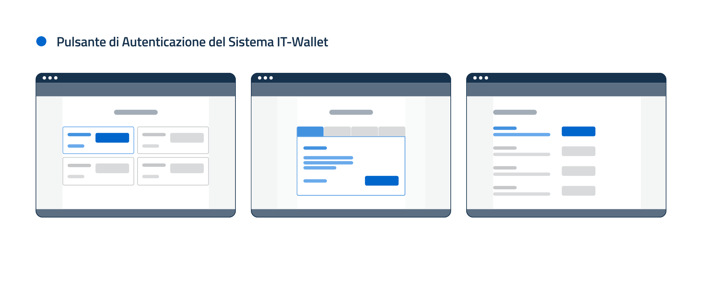

.. _brand-identity:

Brand Identity del Sistema IT-Wallet 
###############################

La Brand Identity del Sistema IT-Wallet definisce la personalità del sistema e si declina in una serie di elementi codificati che la contraddistinguono, tra cui il naming e gli elementi propri dell’Identità Visiva. Questa contribuisce a rafforzare e promuovere il Modello della Fiducia che sta alla base dell’intero ecosistema ovvero il modello che legittima la partecipazione degli attori al Sistema IT-Wallet e ne determina la sicurezza e l'integrità dei processi. 

È quindi importante che la consapevolezza dell’Utente e la sua fiducia nell’ecosistema siano favoriti dalla presenza di elementi grafici, da integrare nelle Soluzioni Tecniche e nei diversi Touchpoint. 

Questa sezione illustra i requisiti minimi che gli Attori Primari devono rispettare per garantire una corretta applicazione della Brand Identity del Sistema IT-Wallet, quindi una sua presenza visiva uniforme, coerente e riconoscibile e un’Esperienza Utente di qualità. 

Per indicazioni e strumenti a supporto, fare riferimento alle Risorse Ufficiali. 

 

Naming 
********

 
“Sistema IT-Wallet" (IT-Wallet System in inglese) o “IT-Wallet" in forma contratta è il nome ufficiale che DEVE essere utilizzato in contesti scritti o verbali, fisici o digitali. Di seguito i relativi requisiti per la corretta scrittura e pronuncia: 

- si DEVE rispettare l’uso delle maiuscole nel termine “IT” e nelle iniziali di “Wallet” e “Sistema”; 

- si DEVE rispettare l’uso del trattino tra i termini “IT” e “Wallet”, senza l’uso di spaziature; 

- si DEVE rispettare la corretta pronuncia del termine “IT”, separando foneticamente le due lettere “I” e “T”. In italiano la fonetica corretta è /i ti/ e non /it/, mentre in inglese la fonetica corretta è /ˌaɪ ˈtiː/ e non /ɪt/, /aɪt/ o /ɪti/. 
 

Identità Visiva
*****************

Il Sistema IT-Wallet ha una sua propria un’Identità Visiva. Pertanto, i diversi attori dell’ecosistema DEVONO garantire che la propria Identità Visiva e quella delle proprie Soluzione Tecniche siano in grado di distinguersi e allo stesso tempo di dialogare e coesistere con quella del Sistema IT-Wallet.  
 
In particolare, tutti gli Attori Primari POSSONO utilizzare le Risorse Ufficiali relative all’Identità Visiva del Sistema IT-Wallet. Il loro utilizzo DEVE avere come unico scopo quello di rappresentare la partecipazione al Sistema IT-Wallet e non di sostituire dell’Identità Visiva della propria Soluzione Tecnica. 

 

Logo 
====

Il Logo è l'elemento grafico ufficiale che permette l’immediata riconoscibilità del Sistema IT-Wallet e ne promuove l’affidabilità. 

Di seguito i requisiti generali per il suo utilizzo, validi sia in riferimento a contesti di utilizzo fisici che digitali (e.g. siti web, applicazioni, documenti cartacei, materiali informativi stampati o video, etc.): 

- il Logo PUÒ essere utilizzato da tutti coloro che intendono riferirsi al Sistema IT-Wallet; 

- il Logo DEVE essere utilizzato per rappresentare il Sistema IT-Wallet o l’appartenenza ad esso e NON DEVE essere utilizzato per identificare una specifica Soluzione Tecnica; 

- il Logo DEVE essere quello presente all’interno delle Risorse Ufficiali e DEVE seguire le relative specifiche di utilizzo disponibili nelle Risorse Ufficiali; 

- il Logo DEVE essere utilizzato in formato ``application/svg +xml``; 

- il Logo NON DEVE essere alterato, distorto, modificato o sostituito da loghi non ufficiali; 

- il Logo DEVE essere utilizzato garantendo l'area di rispetto minima definita nelle Risorse Ufficiali, al fine di garantirne un’adeguata visibilità e riconoscibilità. Altri elementi grafici o testuali NON DEVONO interferire con questa area di rispetto; 

- il Logo NON DEVE essere ridimensionato oltre i limiti minimi stabiliti dalle Risorse Ufficiali, in modo da garantire sempre una leggibilità ottimale su qualsiasi formato o dispositivo; 

- il Logo NON DEVE essere utilizzato su sfondi di colore che ne compromettano la visibilità o la leggibilità. DEVE essere garantito un contrasto adeguato tra il Logo e lo sfondo, in conformità con quanto definito nelle Risorse Ufficiali; 

- il Logo PUÒ essere associato a loghi, marchi o simboli di altri attori del sistema in accordo con le specifiche di coesistenza, in termini di proporzioni e visibilità, stabilite nelle Risorse Ufficiali. 

Trust Mark 
===========

Il Trust Mark è l'elemento grafico ufficiale che dà prova agli Utenti dell’appartenenza al Sistema IT-Wallet degli attori del Sistema IT-Wallet e delle relative Soluzioni Tecniche con cui interagisce.  

Di seguito i requisiti generali per il suo utilizzo, validi sia in riferimento a contesti di utilizzo fisici che digitali (e.g. siti web, applicazioni, documenti cartacei, materiali informativi stampati o video, etc.): 

- il Trust Mark DEVE essere utilizzato esclusivamente per dare prova dell’appartenenza al Sistema IT-Wallet e non DEVE essere utilizzato per scopi diversi; 

- il Trust Mark DEVE essere esposto esclusivamente dalle Soluzioni Tecniche che hanno concluso con successo il processo di certificazione; 

- il Trust Mark DEVE essere quello presente all’interno delle Risorse Ufficiali e DEVE seguire le relative specifiche di utilizzo disponibili presso le Risorse Ufficiali, per garantirne un’adeguata visibilità in tutte le fasi dell’Esperienza Utente; 

- il Trust Mark NON DEVE essere alterato, distorto, modificato o sostituito da loghi non ufficiali. 

- il Trust Mark NON DEVE essere ridimensionato oltre i limiti minimi stabiliti dalle Risorse Ufficiali, in modo da garantire sempre una leggibilità ottimale su qualsiasi formato o dispositivo; 

- il Trust Mark DEVE essere utilizzato garantendo l'area di rispetto minima definita nelle Risorse Ufficiali, al fine di garantirne un’adeguata visibilità e riconoscibilità. Altri elementi grafici o testuali NON DEVONO interferire con questa area di rispetto; 

- il Trust Mark NON DEVE essere utilizzato su sfondi di colore che ne compromettano la visibilità o la leggibilità. DEVE essere garantito un contrasto adeguato tra il Logo e lo sfondo, in conformità con quanto definito nelle Risorse Ufficiali; 

- il Trust Mark PUÒ essere associato a loghi, marchi o simboli di altri attori del sistema in accordo con le specifiche di coesistenza, in termini di proporzioni e visibilità, stabilite nelle Risorse Ufficiali. 

Componenti 
===========

I componenti rappresentano quegli elementi del Sistema IT-Wallet che abilitano l’Utente a interagire con le diverse Soluzioni Tecniche tramite la propria Istanza IT-Wallet.  

Le Risorse Ufficiali mettono a disposizione sia componenti complessi, ovvero template relativi a interi flussi, sia componenti atomici, ovvero singoli elementi da integrare all’interno di interfacce preesistenti (e.g. i Pulsanti di Ingaggio). 

Di seguito i requisiti generali: 

- gli Attori Primari DEVONO utilizzare esclusivamente le Risorse Ufficiali e DEVONO rispettare le indicazioni descritte nelle Risorse Ufficiali; 

- gli Attori Primari POSSONO scegliere quale configurazione, tra quelle rese disponibili, implementare, ma DEVONO comunque garantire il corretto utilizzo dei componenti atomici come i Pulsanti di Ingaggio; 

- gli Attori Primari DEVONO garantire il costante aggiornamento dei componenti, in linea con l’ultima versione resa disponibile. 

 

Pulsante di Autenticazione 
===========================

Il Pulsante di Autenticazione è un esempio di Pulsante di Ingaggio. 

I Verificatori di Attestati Elettronici DEVONO rendere disponibile il Pulsante di Autenticazione all’interno della Discovery Page delle proprie Soluzioni Tecniche per permettere all’Utente di Autenticarsi ai propri servizi tramite un’Istanza IT-Wallet.  

Le modalità di integrazione del Pulsante di Autenticazione nella Discovery Page possono essere molteplici a seconda del layout della pagina stessa. Di seguito alcuni esempi illustrativi e non esaustivi di Discovery Page, rispettivamente con struttura a griglia, a tab e in lista. 

Per maggiori dettagli sull’utilizzo del Pulsante di Autenticazione vedi la sezione :ref:`Autenticazione`. 

Il Pulsante di Autenticazione è caratterizzato dai seguenti requisiti: 

- il Pulsante di Autenticazione DEVE essere usato come delineato nelle Risorse Ufficiali; 

- il Pulsante di Autenticazione DEVE essere visivamente distinto da altri Pulsanti di Autenticazione o altri pulsanti di azione;  

- il Pulsante di Autenticazione DEVE essere utilizzato esclusivamente nelle forme, dimensioni e proporzioni stabilite dalle Risorse Ufficiali e NON DEVE essere alterato, distorto o nascosto; 

- il Pulsante di Autenticazione DEVE adattarsi a tutte le risoluzioni di schermo e DEVE garantire requisiti minimi di usabilità e accessibilità. 
